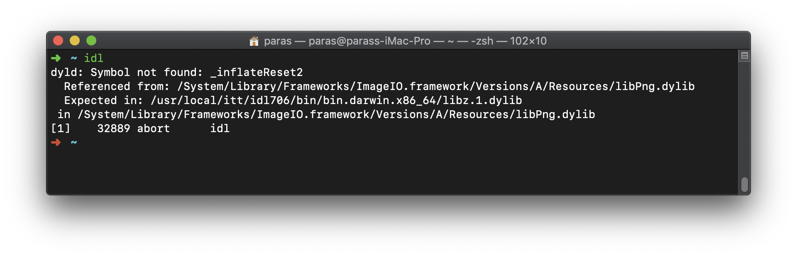

## Index:

1. [Mac Change Global View Options](#Mac-Change-Global-View-Options)
2. [Installing oh-my-zsh](#Installing-oh-my-zsh)
3. [Proxy ON/OFF Scripts](#Proxy-ON/OFF-Scripts)
4. [Installing IDL](#Installing-IDL)
5. [Installing Exofastv2](#Installing-Exofastv2)
6. [Mac Customisation](#Mac-Customisation)

---

<br>

### Mac Change Global View Options

---

Use as Defaults is supposed to carry over to all newly opened Finder windows, but it doesn't change any previously opened windows. If you want to revert all previously opened windows to that view, follow these steps:

Launch the Terminal app (in /Applications/Utilities/), copy & paste this command into the window that pops up, and hit the return key:


```shell
sudo find / -name ".DS_Store"  -exec rm {} \;
```
At the Password: prompt, carefully enter your admin password, since nothing shows up on the screen, and hit the return key. When the default prompt, usually the $ sign, pops up again, quit the Terminal app, restart, and open a Finder window, set it up the way you want, and click on Use as Defaults button. All subsequently opened or created folders should retain that view. 

---

<br>

### Installing oh-my-zsh
```shell
echo "no" | sh -c "$(curl -fsSL https://raw.githubusercontent.com/robbyrussell/oh-my-zsh/master/tools/install.sh)"

# adding plugins
git clone https://github.com/zsh-users/zsh-autosuggestions ${ZSH_CUSTOM:-~/.oh-my-zsh/custom}/plugins/zsh-autosuggestions
git clone https://github.com/zsh-users/zsh-syntax-highlighting.git ${ZSH_CUSTOM:-~/.oh-my-zsh/custom}/plugins/zsh-syntax-highlighting
git clone https://github.com/zsh-users/zsh-completions ${ZSH_CUSTOM:=~/.oh-my-zsh/custom}/plugins/zsh-completions

# adding plugins in zshrc
sed -i -e 's/^plugins=.*/plugins=(sudo git zsh-autosuggestions zsh-completions zsh-syntax-highlighting)/' ~/.zshrc
# =======================================================================

# changing default shell to zsh
chsh -s $(which zsh)
```

### Proxy ON/OFF Scripts

---

:warning: Doesn't Works on `fish` shell use `ohmyzsh` instead.

Works if `~/.bash_profile` contains environment variables as shown below:
```shell
export http_proxy="http://<user>:<passwd>@172.16.0.1:3128/"
export https_proxy="http://<user>:<passwd>@172.16.0.1:3128/"
export ftp_proxy="http://<user>:<passwd>@172.16.0.1:3128/"

export HTTP_PROXY="http://<user>:<passwd>@172.16.0.1:3128/"
export HTTPS_PROXY="http://<user>:<passwd>@172.16.0.1:3128/"
export FTP_PROXY="http://<user>:<passwd>@172.16.0.1:3128/"

export no_proxy='localhost,127.0.0.1,*.my.lan.domain'
export NO_PROXY='localhost,127.0.0.1,*.my.lan.domain'
```

then execute commands below to add `proxy_on` and `proxy_off` functions to your shell
```shell
echo -e '\n' >> ~/.bash_profile
echo 'proxy_on(){' >> ~/.bash_profile
echo "	sed -i -e  '/h/ s/^#export[[:space:]]HTTP/export HTTP/' ~/.bash_profile " >> ~/.bash_profile
echo "	sed -i -e  '/h/ s/^#export[[:space:]]FTP/export FTP/' ~/.bash_profile " >> ~/.bash_profile
echo "	sed -i -e  '/h/ s/^#export[[:space:]]http/export http/' ~/.bash_profile " >> ~/.bash_profile
echo "	sed -i -e  '/h/ s/^#export[[:space:]]ftp/export ftp/' ~/.bash_profile " >> ~/.bash_profile
echo "	sed -i -e  '/h/ s/^#export[[:space:]]no_proxy/export no_proxy/' ~/.bash_profile " >> ~/.bash_profile
echo "	sed -i -e  '/h/ s/^#export[[:space:]]NO_PROXY/export NO_PROXY/' ~/.bash_profile " >> ~/.bash_profile
echo '}' >> ~/.bash_profile

echo -e '\n' >> ~/.bash_profile
echo 'proxy_off(){' >> ~/.bash_profile
echo "	sed -i -e  '/h/ s/^export[[:space:]]HTTP/#export HTTP/' ~/.bash_profile " >> ~/.bash_profile
echo "	sed -i -e  '/h/ s/^export[[:space:]]FTP/#export FTP/' ~/.bash_profile " >> ~/.bash_profile
echo "	sed -i -e  '/h/ s/^export[[:space:]]http/#export http/' ~/.bash_profile " >> ~/.bash_profile
echo "	sed -i -e  '/h/ s/^export[[:space:]]ftp/#export ftp/' ~/.bash_profile " >> ~/.bash_profile
echo "	sed -i -e  '/h/ s/^export[[:space:]]no_proxy/#export no_proxy/' ~/.bash_profile " >> ~/.bash_profile
echo "	sed -i -e  '/h/ s/^export[[:space:]]NO_PROXY/#export NO_PROXY/' ~/.bash_profile " >> ~/.bash_profile
echo '}' >> ~/.bash_profile
```

---

<br>

## Installing IDL

**Prerequesties**  

* Xquartz  
using brew: `brew cask install xquartz`  
**OR**  
using dmg from xquartz webpage: [download](https://www.xquartz.org/)  


**Installing IDL**  

Download from [here](https://drive.google.com/uc?id=1RBBZztZ3_W92uMUySzQ5RCAOYFB6uWiD&export=download)  
then `cd` to directory where you have downloaded the idl and execute following commands:  

```shell
sudo tar -xvf idl_mac.tar --directory /usr/local/
cd /usr/local/itt
sudo chmod +x /usr/local/itt/install
sudo /usr/local/itt/install
```


**Installing idl libraries**

libraries: coyote and astron

```shell
cd ~
wget https://idlastro.gsfc.nasa.gov/ftp/coyote_astron.tar.gz
wget https://idlastro.gsfc.nasa.gov/ftp/astron.zip
mkdir astron
unzip ./astron.zip -d ./astron
tar -xvf coyote_astron.tar.gz
sudo mv ./astron/ /usr/local/itt/idl/lib/
sudo mv ./pro/coyote/ /usr/local/itt/idl/lib/
rm -rf ./pro
```

:warning:**Fixing zlib issue**

If you encounter following error:



The execute following command to fix it.

```shell
sudo rm -rf /usr/local/itt/idl706/bin/bin.darwin.x86_64/libz.1.dylib
```

---

<br>

### Installing Exofastv2

---

**Dependencies**:

* IDLAstro

  ```shell
  mkdir -p $HOME/idl
  cd $HOME/idl
  git clone https://github.com/wlandsman/IDLAstro.git
  ```

    

**Installing Exofastv2**

```shell
cd $HOME/idl
git clone https://github.com/jdeast/EXOFASTv2.git
```


Then execute following commands to define necessary paths in your `bash_profile`

```shell
echo -e '\n' >> ~/.bash_profile
echo '# if IDL_PATH is not defined, add EXOFAST_PATH and subdirectories to the default IDL path' >> ~/.bash_profile
echo 'if [ -z "$IDL_PATH" ]; then' >> ~/.bash_profile
echo 'IDL_PATH="<IDL_DEFAULT>:+${EXOFAST_PATH}" ; export IDL_PATH' >> ~/.bash_profile
echo 'else' >> ~/.bash_profile
echo '# otherwise, append EXOFAST_PATH and all subdirectories to your IDL_PATH' >> ~/.bash_profile
echo 'IDL_PATH="${IDL_PATH}:+${EXOFAST_PATH}" ; export IDL_PATH' >> ~/.bash_profile
echo 'fi' >> ~/.bash_profile

```

Testing exofastv2

```shell
cd $EXOFAST_PATH/examples/hat3
idl -e "fithat3"
```

---

<br>

### Mac Customisation

---

* **Launch Terminal from keyboard shortcut**

  https://claudiodangelis.com/osx/2012/09/27/osx-launch-terminal-from-shortcut.html


* **Window Tiling**
  https://www.macupdate.com/app/mac/61314/tiles

  

* **Open in terminal Context-Menu**
  https://github.com/qparis/FinderOpenTerminal

  

* **Anaconda PATH on fish shell**

  ```shell
  export PATH="/Users/dishendra/anaconda3/bin/:$PATH"
  ```

---
